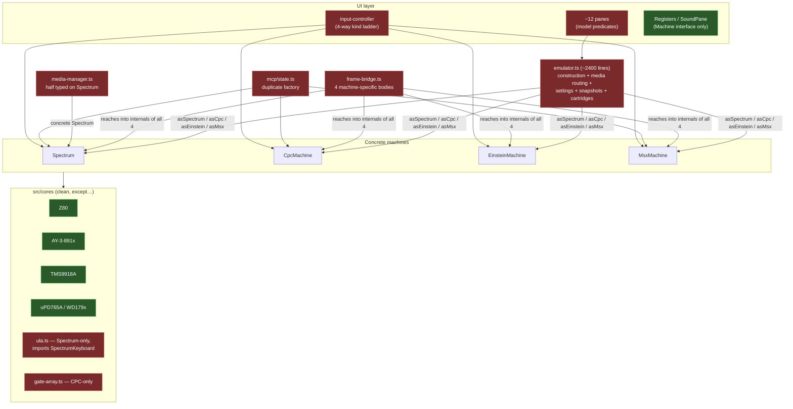
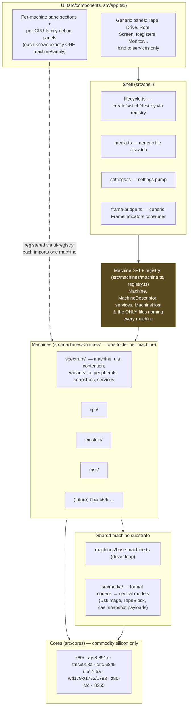
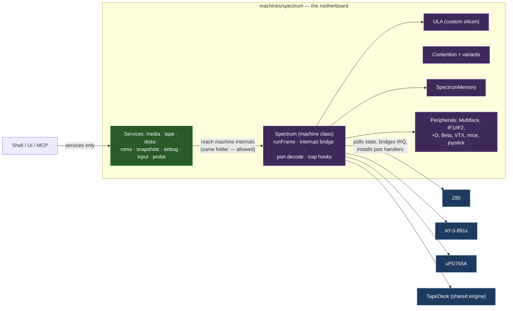
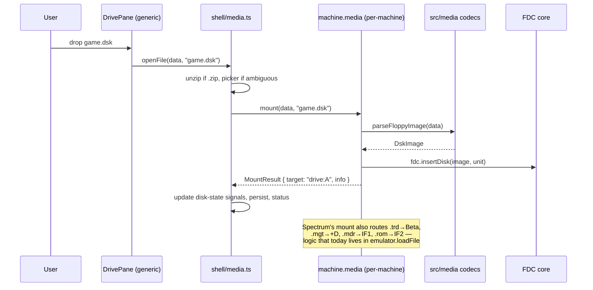

# ZX84 Re-Architecture — Machines as Hardware, Components as Chips

**Status:** proposed · **Audience:** the engineer/agent executing the migration · **Scope:** whole `src/` + `mcp/`

This document defines the target architecture for ZX84 as it grows beyond four machines
(Spectrum, CPC, Einstein, MSX — with 6502-based machines expected later), and a phased,
independently-shippable migration plan. Every claim about the current code below was
verified against the source in July 2026; file:line references are from that audit.

---

## 1. Design goals (the contract)

1. **Chips don't know machines.** A component in `src/cores/` models a piece of
   commodity silicon (Z80, AY-3-891x, TMS9918A, uPD765A, WD179x, CRTC 6845, Z80 CTC).
   It exposes pins/registers/state and imports nothing above the cores layer — exactly
   like the real part, which works the same whether it's soldered into a Spectrum or an
   Oric. Custom silicon that only ever existed in one machine (the Spectrum's Ferranti
   ULA, the CPC's Amstrad gate array) is **part of that machine**, not a shared core.
2. **No component knows more than one machine.** The only files allowed to mention
   more than one machine are two small *manifests*: the machine registry and the model
   union — a parts catalog, not logic. Everything else either belongs to exactly one
   machine or is machine-agnostic.
3. **Machines are motherboards.** A machine folder instantiates chips, wires port
   decode, mediates interrupts, and owns its custom silicon, peripherals, media
   routing, snapshot formats, and settings application. Hard-coded wiring *inside* a
   machine is correct — that's copper traces. What's forbidden is the wiring leaking out.
4. **UI binds to services, not machines.** The tape, disk, and ROM panes (and every
   other generic pane) interact only with narrow management interfaces
   (`TapeService`, `DiskService`, `RomService`, …). Each machine supplies its own
   implementation of those routines. No UI component imports a concrete machine or
   branches on machine kind.
5. **CPU-family-pluggable debugging.** The shared machine surface must not assume Z80.
   A machine declares its CPU family; the debug UI and MCP tools bind to a per-family
   debug provider. A 6502 machine brings its own disassembler, register panel, and
   trace format — with a *different debug UI component*, which is acceptable.
6. **Zero performance regression.** Hot paths (per-t-state stepping, per-byte
   memory access, per-scanline rendering, port dispatch) keep their current concrete,
   monomorphic call structure. All new abstraction lives on cold paths: wiring time,
   user actions, and at most once-per-frame. See §6.

---

## 2. Where we are today (audit summary)

Three exhaustive coupling audits (cores↔machines, UI/state↔machines,
peripherals/media↔machines) found:

**Already clean — preserve, don't churn:**

- `src/cores/` is pure except one import: `ula.ts:11` imports `SpectrumKeyboard`.
  No core imports any machine, `models.ts`, state, or UI. Chip↔chip type imports
  (`gate-array`→`CrtcLine`, `wd1772/wd1793`→`wd179x`, FDCs→`disk-image` types) are fine.
- Cores never call the machine; each machine's `runFrame` polls chip state and bridges
  interrupts to the CPU (four different, correct wirings). Keep this model.
- `src/floppy/` has zero machine imports — formats parse into the neutral
  `DskImage` model; the `cpc: boolean` on images is data, not coupling.
- `src/tape/tap.ts` (`TapeDeck`) is machine-agnostic (per-machine CPU clock +
  `pulseScale`); machine-specific loading is already isolated in per-machine trap
  modules (`tape/tape-loader.ts`, `cpc/cpc-tape-loader.ts`, `msx/msx-tape.ts`).
- `BaseMachine` (frame loop, pacing, turbo pump, lifecycle, debug fields) is shared
  scaffolding with per-machine hooks — keep as-is.
- `managers/debug-manager.ts`, `audio.ts`, `components/Registers.tsx`, the Spectrum
  snapshot codecs (narrow `(cpu: Z80, memory: SpectrumMemory)` signatures), and
  `models.ts` (leaf module) are machine-agnostic or correctly scoped.

**The violations, ranked by blast radius:**

| # | Site | Problem |
|---|------|---------|
| 1 | `src/emulator.ts` (~2,400 lines) | God module: machine construction, model switching, ROM plumbing, `loadFile` four-way machine cascade (`:1084-1200`), per-machine settings application (`:283-334`), MSX/IF2 cartridge routines, CPC snapshot load/save, tape stashing, plus re-exporting every state signal. ~40 `asSpectrum()/asCpc()/asEinstein()/asMsx()` narrowings. |
| 2 | `src/frame-bridge.ts` | Four machine-specific per-frame bodies reaching into `activity`, `tape`, `fdc`, peripheral motors, `memory` internals of all four machines (`:523-739`). |
| 3 | `src/managers/media-manager.ts` | Tape half generic; disk/snapshot half typed on concrete `Spectrum`, reaching `ula.borderColor`, `ay.setRegisters`, `memory.port7FFD/applyBanking` (`:123-402`). |
| 4 | `src/machine.ts` | The shared interface leaks concrete chips (`cpu: Z80`, `ay: AY3891x`, `fdc: UPD765A \| WD179x`, `tape: TapeDeck`) and a Z80-shaped debug surface (`disasmAt(): DisasmLine`) — blocks 6502 machines and forces every consumer to know chip types. |
| 5 | `src/input-controller.ts` | Four-way `kind` ladder with concrete casts in three handlers (`:144-197`). |
| 6 | UI panes | `HardwarePane.tsx` has four per-machine `<Show>` blocks + 8 model predicates; `Screen.tsx` has three geometry branches; ~12 panes import model predicates; `MemoryPane.tsx` narrows with `asCpc`/`asSpectrum`. |
| 7 | `mcp/state.ts` | A *second* machine factory (`initMachine`, `:38-61`) that duplicates `emulator.ts` construction and has drifted (no Einstein branch). |
| 8 | `src/cores/ula.ts`, `src/cores/gate-array.ts`, `src/cores/microdrive.ts` | Machine-custom silicon misfiled in the shared cores folder. |
| 9 | `src/peripherals/joysticks.ts:9`, `amx-mouse.ts:16` | Peripherals importing the concrete `Spectrum` type / `IOActivity` from `spectrum.ts`. |
| 10 | `src/snapshot/cpc-sna.ts` | Takes whole `CpcMachine` — fine content, wrong home (it belongs inside the CPC's folder). |
| 11 | `src/library/catalog.ts` | Load planning is structurally Spectrum-shaped. |



---

## 3. Target architecture

### 3.1 Layers

Dependencies point strictly downward. A layer never imports from a layer above it,
and machine folders never import each other.



**Import rules (enforced mechanically — see §7):**

| From | May import |
|---|---|
| `src/cores/**` | other cores, `src/media/` *types*, `src/utils/` |
| `src/media/**` | `src/utils/` only (pure data + codecs) |
| `src/machines/<name>/**` | own folder, `src/machines/machine.ts` (SPI), `base-machine.ts`, `src/cores/`, `src/media/`, `src/utils/` — **never** another machine folder, never shell/state/components/store |
| `src/machines/registry.ts` | every machine folder's `descriptor.ts` (manifest exception) |
| `src/shell/**` | SPI + registry, `src/state/`, `src/store/`, `src/media/` (for zip only), `src/display/` |
| `src/components/**` (generic) | SPI types, `src/state/`, shell actions — **never** a machine folder |
| `src/machines/<name>/ui/**` | own machine folder + solid-js (the only machine files allowed to import solid) |
| `mcp/**` | SPI + registry + services (headless: must not transitively import solid-js or `src/state/`) |

### 3.2 The slimmed `Machine` interface (SPI)

The current `Machine` interface leaks `cpu: Z80`, `ay: AY3891x`,
`fdc: UPD765A | WD179x`, `tape: TapeDeck`, and a Z80 `disasmAt`. The replacement
exposes **lifecycle + services** and nothing chip-shaped:

```ts
// src/machines/machine.ts — sketch, refine during Phase 2
export interface Machine {
  readonly descriptor: MachineDescriptor;   // static metadata (see below)

  // ── Lifecycle / driver (unchanged from BaseMachine) ──
  start(): Promise<void>; stop(): void; destroy(): void; reset(): void;
  tick(): void; runUntil(maxFrames: number): number;
  turbo: boolean;
  readonly pixels: Uint8Array;
  display: IScreenRenderer | null;
  setBorderSize(mode: BorderMode): void;

  // ── Host wiring (shell/MCP provide; machine calls out through this only) ──
  attachHost(host: MachineHost): void;

  // ── Services — the ONLY way anything above reaches machine internals ──
  readonly media: MediaService;             // file routing + mount/eject
  readonly roms: RomService;                // system ROM slots + cartridge slots
  readonly tape: TapeService | null;        // null ⇒ no cassette hardware
  readonly disks: DiskService | null;       // null ⇒ no drives fitted
  readonly snapshots: SnapshotService | null;
  readonly debug: DebugService;             // CPU-family-specific provider
  readonly input: InputService;             // host key/joystick/mouse events in
  readonly probe: FrameProbe;               // per-frame indicators out

  applySettings(view: SettingsView): void;  // machine reads only keys it cares about
}

export interface MachineHost {
  setStatus(msg: string): void;
  /** e.g. a 128K-only snapshot arriving on a 48K: machine asks, shell decides. */
  requestModel(model: MachineModel, reason: string): Promise<boolean>;
  persistMedia(kind: string, data: Uint8Array | null, name: string): void;
}

export interface MachineDescriptor {
  readonly kind: string;                    // 'spectrum' | 'cpc' | …
  readonly model: MachineModel;
  readonly cpuFamily: 'z80' | 'm6502';      // extend as families are added
  readonly screen: { width: number; height: number; pixelAspectX: number };
  readonly tStatesPerFrame: number;
}
```

Notes:

- `BaseMachine` keeps its concrete `breakpoints`/watchpoint fields — they move
  behind `DebugService` accessors on the interface, but the *storage* stays where the
  frame loop checks it (hot path, no indirection added).
- The `asSpectrum/asCpc/asEinstein/asMsx` helpers are **deleted at the end of the
  migration**. Until then they remain as scaffolding.
- Machines never import Solid signals or `src/store/settings.ts`. The shell snapshots
  settings into a plain `SettingsView` (a read-only accessor over the generic
  key/value settings store) and pushes it via `applySettings` on change and at build.

### 3.3 The services (management routines)

These are the "management routines" the tape/disk/ROM UI talks to. Each machine
implements them over its own hardware; a machine that lacks the hardware returns
`null` and the pane hides/disables itself. **UI never checks machine kind.**

```ts
// All methods are cold-path (user actions / pane rendering). Sketches:

export interface MediaService {
  /** Extensions the Load picker offers, with routing hints ("drive A", "cartridge"). */
  accepts(): MediaTypeDescriptor[];         // replaces loadableExtensions()
  /** Route a file to the right device. The machine owns ALL routing logic. */
  mount(data: Uint8Array, filename: string, target?: MediaTargetId): Promise<MountResult>;
}

export interface TapeService {                       // Spectrum/CPC/Einstein: over TapeDeck.
  readonly blocks: readonly TapeBlockInfo[];         // MSX: over MsxCassette (.cas blocks)
  readonly position: number;                         //   — unifying today's split
  playing: boolean; paused: boolean;                 //   tapeBlocks/casBlocks signals.
  play(): void; stop(): void; rewind(): void; seek(block: number): void;
  eject(): void;
  readonly name: string;
}

export interface DiskService {
  readonly drives: readonly DriveDescriptor[];       // id, label ("A:", "Drive 0"),
  mount(drive: number, image: DskImage, name: string): void;   // wp, capabilities
  eject(drive: number): void;
  save(drive: number): Uint8Array | null;            // serialize for download
  setWriteProtect(drive: number, on: boolean): void;
}

export interface RomService {
  readonly systemSlots: readonly RomSlotInfo[];      // pages, labels, overridden
  setSystemRom(data: Uint8Array, label: string, page?: number): Promise<void>;
  resetSystemRom(page?: number): Promise<void>;
  readonly cartridge: CartridgeSlot | null;          // MSX slot, IF2 slot, or null
}

export interface SnapshotService {
  formats(): { ext: string; canSave: boolean }[];
  apply(data: Uint8Array, filename: string): Promise<void>;
  save(ext: string): Uint8Array;
}

export interface DebugService {
  readonly cpuFamily: 'z80' | 'm6502';
  regs(): RegisterSnapshot;                          // named regs + widths, generic shape
  setReg(name: string, value: number): void;
  disasm(addr: number, lines: number): DisasmRow[];  // family-specific impl behind it
  startTrace(mode: string): void; stopTrace(): string;
  mem: MemoryDebugView;                              // snapshot()/banks — today's IMachineMemory debug half
  breakpoints / watchpoints accessors;               // thin views over BaseMachine fields
  ocr(mode?: string): string;                        // screen OCR (per machine)
  panels(): DebugPanelDescriptor[];                  // which extra panes exist (sysvars,
}                                                    //   BASIC, banks) — data, not components

export interface InputService {
  keyDown(e: HostKeyEvent): boolean;                 // machine maps host keys itself —
  keyUp(e: HostKeyEvent): void;                      //   kills the input-controller ladder
  releaseAll(): void;
  mouse?: MouseSink; joystick?: JoystickSink;
}

export interface FrameProbe {
  /** Fill the SHARED, preallocated indicators struct. Called once per rAF.
   *  MUST NOT allocate. Replaces frame-bridge's four machine bodies. */
  sample(out: FrameIndicators): void;
}
```

`FrameIndicators` is one mutable struct (numbers/booleans/small fixed arrays) covering
the union of dashboard needs: LED levels keyed by *generic* channel names
(`keyboard`, `pointer`, `tapeIn`, `tapeLoad`, `disk`, `beeper`, `psg`, `videoFx`,
`text`), per-drive motor/track activity, tape motion, speed, OCR-dirty flag. Machines
without a channel leave it at zero; StatusBar renders only channels the descriptor
declares. The Spectrum maps `kempstonReads`→`pointer`, `attrWrites`→`videoFx`, etc. —
the *mapping* lives in the Spectrum's probe, not in frame-bridge.

### 3.4 A machine folder is a motherboard

Everything specific to one machine lives in its folder. Spectrum shown; CPC/Einstein/
MSX are the same shape (their folders already exist and mostly comply):

```
src/machines/spectrum/
  descriptor.ts        # pure metadata + factory (imported by registry)
  spectrum.ts          # the machine class (extends BaseMachine)
  ula.ts               # ← moves from src/cores/ (custom Ferranti silicon)
  contention.ts        # ← moves from src/
  variants/            # ← moves from src/variants/ (Spectrum-model strategies)
  memory.ts            # ← SpectrumMemory, from src/memory.ts
  io.ts                # ← src/io-ports.ts (port decode if-chain — unchanged, hot)
  keyboard.ts          # ← src/keyboard.ts
  models.ts            # SpectrumModel union + is128kClass etc. (from src/models.ts)
  peripherals/         # multiface, vtx5000, interface1/2, mgt-plusd, beta-disk,
                       #   microdrive (← from cores/), joystick, mice
  tape-loader.ts       # ← src/tape/tape-loader.ts (ROM trap; the deck stays shared)
  snapshots/           # sna/z80/szx/sp apply+save glue (codecs may stay in src/media/)
  services/            # MediaService/TapeService/DiskService/RomService/
                       #   SnapshotService/DebugService/InputService/FrameProbe impls
  ui/                  # HardwarePane section, SysVars pane, keyboard overlay
                       #   (only machine files allowed to import solid-js)
```



Chips never gain back-references. The interrupt model stays exactly as audited:
each machine's `runFrame` polls chip flags (`ga.interruptRequested`,
`ctc.interruptPending`, `vdp.interruptPending()`) and calls `cpu.interrupt()` /
`interruptWithVector()` itself.

One cleanup while moving the ULA: it currently imports the concrete
`SpectrumKeyboard`. Since both now live in the same machine folder this is no longer
a layering violation, but still narrow it to a `KeyMatrixSource`
(`readHalfRows(addrHigh): number`) interface — a real ULA reads row lines, not
"a keyboard object".

### 3.5 Registry — the only place that knows every machine

```ts
// src/machines/registry.ts — the manifest (plus src/models.ts for the model union)
import { spectrumEntries } from './spectrum/descriptor.ts';
import { cpcEntries } from './cpc/descriptor.ts';
import { einsteinEntries } from './einstein/descriptor.ts';
import { msxEntries } from './msx/descriptor.ts';

export interface MachineEntry {
  models: MachineModel[];
  create(model: MachineModel, display: IScreenRenderer | null): Machine;
  romSources(model: MachineModel): RomSource[];   // absorbs rom-manager's URL table
}
export const registry: MachineEntry[] = [...spectrumEntries, ...cpcEntries, ...];
export function entryForModel(model: MachineModel): MachineEntry { … }
```

- The shell's `createMachine()` becomes: destroy old → `entryForModel(model).create(...)`
  → `attachHost` → `applySettings` → done. No `isCpcModel` ladders, no per-machine
  peripheral blocks (peripheral enablement moves into each machine's
  `applySettings`, which reads its own settings keys).
- **`mcp/state.ts`'s duplicate factory is deleted** — MCP calls the same registry.
  This automatically fixes the drift (missing Einstein branch) and prevents the next one.
- The registry must stay importable headless (Node/MCP/tests): descriptors are pure.
  Machine UI contributions are collected in a *separate* UI-side manifest,
  `src/components/machine-ui.ts`, mapping `kind` → lazily-imported Solid components
  (hardware-pane section, sysvars/BASIC panels, per-family debug panels).

### 3.6 Media flow, end to end



The shell keeps only *machine-agnostic* concerns: zip unwrapping, the multi-file
picker, persistence, and reflecting `MountResult` into state signals. Everything
after "which device inside this machine" is the machine's business. A snapshot
needing a different model (`ensure128kROM`, CPC `.sna` model switching) is expressed
as `host.requestModel(model, reason)` — the shell rebuilds and replays the mount.

### 3.7 Debugging across CPU families

- `DebugService.cpuFamily` selects the debug UI: `Z80RegisterPane` /
  `Z80DisassemblyPane` today; a future `M6502RegisterPane` ships with the first 6502
  machine. Generic debug chrome (breakpoint list, memory hex view, trace buttons)
  binds to `DebugService` and works for any family.
- `regs()` returns a *described* register set (name, width, value, groups) so the
  generic parts of the UI and MCP `registers` tool don't hard-code Z80 names; the
  per-family panes may still lay out flags/pairs by hand (they know their family).
- `debug-manager.ts`'s `stepOver`/`stepOut` contain Z80 opcode reasoning — that logic
  moves behind the family provider (`machines/debug-z80/` shared by all Z80 machines;
  a machine folder may import a *family* module, which counts as substrate, not
  another machine).
- Machine-specific panels (Spectrum sysvars, Sinclair/Locomotive BASIC listings,
  128K banks) are declared via `debug.panels()` and rendered by per-machine UI
  contributions. The BASIC detokenizers already exist per machine — they just get
  invoked from the machine's own panel instead of `frame-bridge`.
- MCP: CPU/breakpoint/memory/trace tools stay generic over `DebugService`.
  Machine-specific tools (multiface, vtx5000, disk_boot, library) query for the
  capability and degrade gracefully — same behaviour as today, but via services
  instead of `activeSpectrum()`.

---

## 4. What deliberately does NOT change

- **`BaseMachine`** driver loop, turbo pump, pacing — untouched.
- **Per-machine port decode** (`io-ports.ts` and siblings) — the ordered if-chains
  are hot-path and load-bearing (early returns prevent double-decode); they move
  into machine folders verbatim.
- **Interrupt wiring** — machine-mediated polling stays.
- **`src/floppy/` → `src/media/floppy/`** — rename only; the code is already clean.
- **`TapeDeck`** stays one shared pulse engine in `src/media/tape/`.
- **Solid state stores** (`src/state/`) remain shared flat signal bags — the audit
  showed the coupling lives in the writers, not the stores. Writers become generic
  (shell + FrameProbe). `casBlocks`/`casPosition` merge into the generic tape
  signals via `TapeService`.
- **`models.ts`** stays a leaf manifest for the `MachineModel` union; per-family
  helpers (`is128kClass`, `isPlusDCapable`, …) move into their machine's `models.ts`.
- **Display/renderers, audio ring buffer, settings store** — already generic.

---

## 5. Migration plan — phases for hand-off

Rules for every phase:

- Each phase leaves `npx tsc --noEmit` clean and `npx vitest run` at 0 failed.
  Each is a natural commit point (the user commits; never auto-commit).
- Phases are ordered to de-risk: mechanical moves first, seams next, behaviour last.
- **No behavioural change is intended anywhere.** If a phase forces a behaviour
  choice, stop and surface it.
- After each phase, run the dependency check (§7) — the violation count must be
  monotonically decreasing (tracked in `dep-rules`).
- Verify hot-path integrity per §6 after Phases 2, 5, and 7.

### Phase 0 — Guardrails baseline (small)

1. Add `dependency-cruiser` (dev-dep) with a config encoding the §3.1 import rules,
   with every *current* violation listed as a known exception.
2. Add `npm run depcheck` and wire it next to `tsc` in whatever check script exists.
3. Acceptance: `depcheck` passes with the baseline exception list; the list is the
   burn-down backlog.

### Phase 1 — Mechanical relocation (large but brainless)

Pure `git mv` + import-path fixes. No signature changes except the two noted.

1. Create `src/machines/`. Move machine code:
   - `src/spectrum.ts` → `src/machines/spectrum/spectrum.ts`; `src/io-ports.ts` →
     `spectrum/io.ts`; `src/contention.ts` → `spectrum/contention.ts`;
     `src/variants/*` → `spectrum/variants/`; `src/memory.ts` → `spectrum/memory.ts`
     (re-export `BANK_SIZE` from a neutral `src/utils/` or `machines/` constant —
     `rom-manager` and `emulator` import only that); `src/keyboard.ts` →
     `spectrum/keyboard.ts`; `src/tape/tape-loader.ts` → `spectrum/tape-loader.ts`.
   - `src/cpc/` → `src/machines/cpc/`; `src/einstein/` → `machines/einstein/`;
     `src/msx/` → `machines/msx/` (their tape-loader/config files come along).
   - `src/base-machine.ts`, `src/machine.ts` → `src/machines/`.
2. Move custom silicon out of cores: `cores/ula.ts` → `machines/spectrum/ula.ts`;
   `cores/gate-array.ts` → `machines/cpc/gate-array.ts`; `cores/microdrive.ts` →
   `machines/spectrum/peripherals/microdrive.ts`.
3. Move Spectrum peripherals: `src/peripherals/{multiface,vtx5000,interface1,
   interface2,mgt-plusd,beta-disk,joysticks,amx-mouse}.ts` →
   `machines/spectrum/peripherals/`; `cpc-multiface.ts`, `cpc-amx-mouse.ts` →
   `machines/cpc/peripherals/`. Truly shared ones (`audio-mixer.ts`,
   `kempston-mouse.ts`) → `src/machines/shared/` (or stay in a slimmed
   `src/peripherals/` — pick one, document it).
4. Move snapshot codecs: `src/snapshot/{sna,z80format,szx,sp}.ts` →
   `machines/spectrum/snapshots/`; `cpc-sna.ts` → `machines/cpc/snapshots/`;
   `zip.ts` → `src/media/zip.ts`. `src/floppy/` → `src/media/floppy/`;
   `src/tape/` (minus the moved Spectrum loader) → `src/media/tape/`.
5. Split `src/models.ts`: keep `MachineModel` union + per-family model type
   re-exports as the leaf manifest; move family helpers into
   `machines/<name>/models.ts` (update ~54 import sites mechanically).
6. Two real fixes while touching these files:
   - `joysticks.ts`: replace the `Spectrum` import — `joyPressForType` takes
     `{ joystick: KempstonJoystick; keyboard: SpectrumKeyboard }` (or narrower).
   - `amx-mouse.ts`: move `IOActivity` out of `spectrum.ts` into a neutral
     `machines/spectrum/activity.ts` (it's Spectrum-scoped either way; the point is
     peripherals shouldn't import the machine module).
7. Update `vite.config`/`tsconfig` path aliases if needed; fix `mcp/` imports.
8. Acceptance: tsc clean, tests green, `src/cores/` contains only commodity chips
   with zero non-core imports, `depcheck` exception list shrinks accordingly.

### Phase 2 — Define the SPI (medium; the design phase)

1. Write `src/machines/machine.ts` v2: `MachineDescriptor`, `MachineHost`,
   service interfaces (§3.2–3.3), `FrameIndicators`. Keep the *old* interface
   fields temporarily (the four machines implement both surfaces during transition).
2. Add `descriptor.ts` per machine + `src/machines/registry.ts` (§3.5). Absorb
   `rom-manager`'s `DEFAULT_ROM_URLS` table into per-machine `romSources` (the
   fetch/cache/persist machinery in `rom-manager.ts` stays shared and generic).
3. Switch `createMachine()` (still in `emulator.ts` for now) and `mcp/state.ts`'s
   `initMachine` to the registry. Delete the duplicated construction; MCP gains
   Einstein for free.
4. Acceptance: no `new Spectrum/CpcMachine/EinsteinMachine/MsxMachine` outside
   `machines/**`; both entry points build machines through one factory.

### Phase 3 — Services per machine (large; the heart of it)

Implement services machine by machine, consumer by consumer. Suggested order
(dependency-light first):

1. **`InputService`** (small): each machine wraps its keyboard/joystick classes.
   `input-controller.ts` becomes generic (`machine.input.keyDown(e)`), the four-way
   ladder and concrete type imports are deleted.
2. **`TapeService`**: Spectrum/CPC/Einstein over `TapeDeck`; MSX over `MsxCassette`.
   TapePane + tape-state writers go generic; `casBlocks`/`casPosition` signals die.
   The tape-stash-per-kind logic in `emulator.ts` reduces to stash/restore of an
   opaque `TapeService`-provided snapshot.
3. **`DiskService`** covering *all* drive-bearing devices: the Spectrum exposes its
   uPD765A drives and, when enabled, +D/Beta/IF1 drives as additional
   `DriveDescriptor`s (label, media kinds). DrivePane and disk-state writers go
   generic; per-interface persist glue keys off descriptor ids.
4. **`RomService`**: system ROM pages (Spectrum 128K/+2A splicing logic moves in),
   MSX cartridge slot, IF2 cartridge slot. `insertMsxCartridge`/`insertIf2Cartridge`/
   `ejectCartridge`/`updateRomPaneInfo` leave `emulator.ts`; RomPane goes generic.
5. **`MediaService.mount`**: move the entire `loadFile` cascade (`emulator.ts:1084-1200`)
   into per-machine implementations; move `media-manager.ts`'s Spectrum-typed
   disk/snapshot half into `machines/spectrum/services/`. `media-manager.ts` is
   then deleted (its generic tape half became `TapeService`).
6. **`SnapshotService`**: Spectrum formats + `ensure128kROM` → `host.requestModel`;
   CPC `.sna` load/save moves out of `emulator.ts`.
7. Acceptance per sub-step: the corresponding pane/manager has zero machine imports
   and zero model predicates; grep `asSpectrum|asCpc|asEinstein|asMsx` count strictly
   decreases; `Load picker` extensions now come from `media.accepts()`.

### Phase 4 — Split the shell (medium)

1. Break `emulator.ts` into `src/shell/`: `lifecycle.ts` (create/switch/destroy,
   focus-pause, pause/turbo), `media.ts` (zip/picker/dispatch/persistence),
   `settings.ts` (SettingsView snapshot + `applySettings` pump — replaces
   `applyDisplaySettings`'s four-way branch; display/renderer settings stay in the
   shell since `display` is shell-owned), `rom.ts` (generic fetch/cache via
   registry `romSources`).
2. Delete the state-signal re-export block — UI imports `src/state/*` directly
   (mechanical, many files, zero risk).
3. `emulator.ts` remains only as a thin façade re-exporting shell actions, or is
   deleted once imports are updated.
4. Acceptance: no file in `src/shell/` names a machine kind except via
   registry/descriptor lookups; `emulator.ts` < 100 lines or gone.

### Phase 5 — Frame probe (medium, perf-sensitive)

1. Define `FrameIndicators` (preallocated, mutable). Implement `FrameProbe.sample`
   per machine, porting each of `frame-bridge.ts`'s four bodies into its machine's
   folder (Spectrum's `renderBanks`/sysvars/BASIC move to its debug panels instead).
2. Rewrite `frame-bridge.ts` as the generic consumer: call `probe.sample(shared)`,
   diff against previous, update signals. LED semantics per §3.3.
3. StatusBar/activity panes render descriptor-declared channels only.
4. Acceptance: `frame-bridge.ts` imports nothing from any machine folder; profile a
   busy scene (tape loading + FDC activity) before/after — rAF handler time within
   noise (§6).

### Phase 6 — UI decomposition (medium)

1. `machine-ui.ts` manifest (kind → lazy Solid components).
2. Split `HardwarePane` into a generic shell + per-machine sections living in
   `machines/<name>/ui/`; same for the on-screen keyboard (Spectrum), SysVars,
   BASIC panels, `Screen.tsx` overlay geometry (descriptor supplies geometry), and
   `MemoryPane`'s ROM-view narrowing (a `DebugService.mem` accessor exposes ROM
   regions generically).
3. Sweep the remaining ~12 panes for model predicates; each becomes either
   capability-driven (`machine.tape !== null`) or descriptor-driven
   (`descriptor.cpuFamily`, screen size).
4. Acceptance: `rg "isCpcModel|isEinsteinModel|isMsxModel|is128kClass" src/components src/app.tsx`
   → only inside `machines/*/ui/**` contributions.

### Phase 7 — Debug + MCP (medium)

1. `DebugService` + `machines/debug-z80/` family module (disassembler, step-over
   logic from `debug-manager.ts`, trace formats, register descriptors).
2. Debug panes bind per `cpuFamily`; MCP generic tools use `DebugService`;
   machine-specific MCP tools query services.
3. Slim the `Machine` interface to its final §3.2 shape: remove `cpu`, `ay`, `fdc`,
   `tape: TapeDeck`, `mixer`, `disasmAt`, `ocrScreenForMcp`, `loadROM`, `loadDisk`
   (all now behind services). Delete `asSpectrum/asCpc/asEinstein/asMsx`.
4. Acceptance: `rg "asSpectrum|asCpc|asEinstein|asMsx" src mcp` → zero matches;
   `rg "from '@/machines/spectrum" src/components src/shell src/state mcp` → zero
   (excluding `machine-ui.ts` manifest).

### Phase 8 — Lock it down (small)

1. Remove the last dependency-cruiser exceptions; rules become hard errors.
2. Update `CLAUDE.md`'s architecture section to describe the new layout and rules.
3. Write the "adding a machine" checklist (docs/adding-a-machine.md): create folder,
   implement `Machine` + services over `BaseMachine`, write `descriptor.ts`,
   register in `registry.ts` + `models.ts`, optionally add `ui/` contributions and
   a debug-family module if it's a new CPU. **Nothing else in the tree changes** —
   that is the definition of done for this whole effort.

### Phase 9 (optional, later) — Library generalisation

`library/catalog.ts`'s Spectrum-shaped `planLoad` becomes descriptor-driven
(catalog entries tagged with machine kind + media kind; the plan asks the registry
which model satisfies it). Deferred: it's user-facing behaviour, not architecture.

---

## 6. Performance guardrails (hard requirements)

The emulator's hot paths, in order of heat:

1. **Per-t-state / per-instruction:** Z80 exec loop, `memory.readByte/writeByte`,
   contention lookups, port dispatch closures, `advanceTapeTo`.
2. **Per-scanline / per-cell:** ULA/CRTC/VDP rendering.
3. **Per-frame:** `runFrame`, interrupt bridging, mixer, probe sampling.
4. **Per-user-action:** everything in the services.

Rules the migration must obey:

- **Tiers 1–2 are untouchable.** File *moves* are fine; call-structure changes are
  not. No interface is introduced between a machine and its chips, memory, or port
  handlers. `cpu.portInHandler`/`portOutHandler` stay direct closures. `Contention`
  keeps its concrete `MachineVariant` + `SpectrumMemory` references.
- **The `Machine` interface is only consumed on tiers 3–4.** Inside a machine,
  code refers to concrete `this.ula`, `this.fdc` fields — never through its own
  service interfaces.
- **`FrameProbe.sample` allocates nothing** (one shared struct, overwrite in place)
  and runs at most once per rAF — same budget as today's frame-bridge body.
- **Services may allocate freely** — they run on user actions.
- **Keyboard path:** `InputService.keyDown` is per-host-event (cold);
  the ULA/PPI reading the matrix stays a direct array read (hot).
- **Verification:** after Phases 2, 5, 7 run a turbo-mode benchmark (e.g. MCP
  `runUntil(1000)` headless on 48K + on +3 with FDC activity) and compare
  frames/sec before vs after — regression budget: none beyond run-to-run noise.
  Also confirm no new allocation in the rAF path via a heap-allocation profile
  during tape loading.

---

## 7. Enforcement

`dependency-cruiser` rules (sketch — encode §3.1's table):

```js
// .dependency-cruiser.cjs — forbidden edges (severity: error)
{ name: 'cores-know-nothing',   from: { path: '^src/cores' },
  to: { pathNot: '^(src/cores|src/media|src/utils)' } },
{ name: 'media-is-pure',        from: { path: '^src/media' },
  to: { pathNot: '^(src/media|src/utils)' } },
{ name: 'machines-are-islands', from: { path: '^src/machines/([^/]+)/' },
  to: { path: '^src/machines/(?!$1/|machine|base-machine|registry|shared|debug-)' } },
{ name: 'machines-no-ui',       from: { path: '^src/machines/(?!.*/ui/)' },
  to: { path: '^(src/components|src/state|src/store|src/shell|solid-js)' } },
{ name: 'ui-no-concrete-machines', from: { path: '^src/(components|shell|state)' ,
    pathNot: 'machine-ui' },
  to: { path: '^src/machines/[^/]+/' } },
```

Plus grep-able acceptance checks used through the migration:

```
rg "asSpectrum|asCpc|asEinstein|asMsx" src mcp        # → 0 at end of Phase 7
rg "from '@/machines/" src/components --glob '!machine-ui.ts'   # → 0
rg "isCpcModel|isMsxModel|isEinsteinModel" src/components src/shell  # → 0
```

---

## 8. Risks and mitigations

| Risk | Mitigation |
|---|---|
| Phase 1's mass-move breaks HMR-restore paths / persistence keys | Persistence keys are strings, not paths — audit `store/persistence.ts` key constants once during Phase 1; don't rename keys. |
| Behaviour drift while porting `loadFile` routing (ordering is load-bearing: Beta before +D before uPD765A for `.hfe`) | Port each routing branch verbatim with its comment; add routing unit tests per machine (`media.accepts()` + `mount` target for each extension × peripheral-enable combination) **before** deleting the old cascade. |
| Turbo/tape timing regressions from moved files | No logic changes in Phase 1; timing-sensitive files (`contention.ts`, `io.ts`, loaders) move whole. Run the azesmbog ULA timing test taps after Phases 1 and 5. |
| MCP headless breakage (registry accidentally pulling solid-js) | The `machine-ui` manifest is the only solid importer among machine files and lives under `src/components/`; `mcp` build/test run guards this (depcheck rule `machines-no-ui`). |
| `Machine` interface slimming (Phase 7) breaks stragglers | The old fields are kept until Phase 7 precisely so their removal is one atomic, tsc-verified step. |
| Two agents editing concurrently | Phases are file-disjoint where possible; within a phase, land sub-steps consumer-by-consumer, each tsc-clean. |

---

## 9. Definition of done

- Adding machine #5 (including a 6502 machine) touches: a new `src/machines/<name>/`
  folder, one line each in `registry.ts` and `models.ts`, optional `ui/`
  contributions, optional new `debug-<family>/` module. Nothing else.
- `src/cores/` contains only chips that shipped in unrelated machines, with no
  imports above the cores layer.
- No file outside `src/machines/` (except the two manifests) names a machine kind.
- Tape/Disk/Rom/Hardware/Debug panes contain zero machine conditionals.
- `emulator.ts`'s responsibilities live in `src/shell/` as four small modules.
- `npx tsc --noEmit` clean, `npx vitest run` 0 failed, `npm run depcheck` 0 errors,
  benchmark parity per §6.
